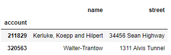
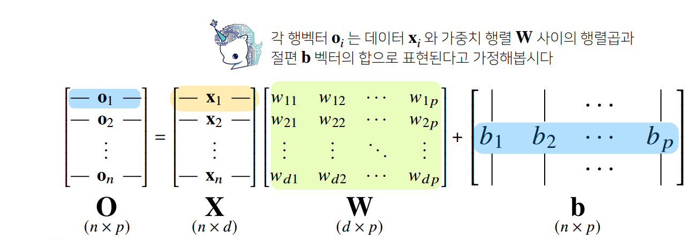
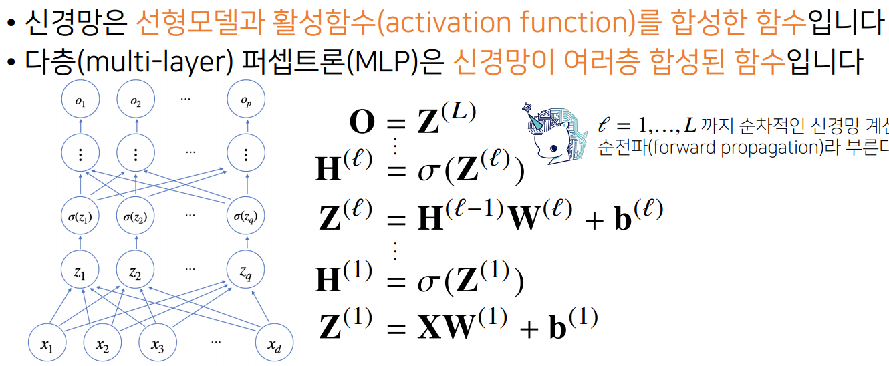
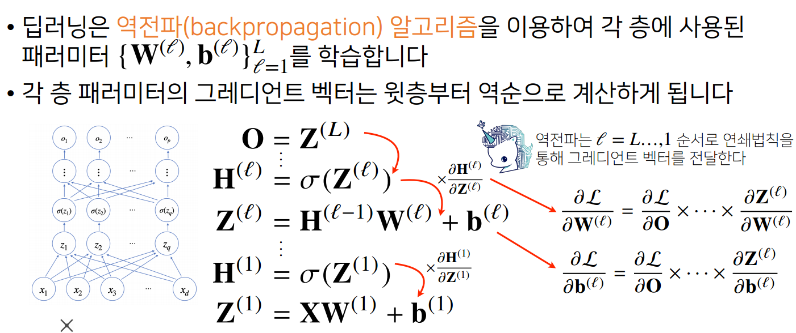

#### pandas as pd
### pandas는 구조화된 데이터를 다루는 라이브러리 python계의 엑셀이라고 불린다.

    data_url = 'https://archive.ics.uci.edu/ml/machine-learning-databases/housing/housing.data' #Data URL
    #data_url = "./housing.data"  # Data URL
    df_data = pd.read_csv(
        data_url, sep="\s+", header=None
    )  # csv 타입 데이터 로드, separate는 빈공간으로 지정하고, Column은 없음

#### Series데이터
- ndarray의 sub class 지만,numpy와 다르게 index가 있음.
    list_data = [i for i in range(10,1,-1)] 
    ex_obj = pd.Series(data = list_data)
    
    0    10
    1     9
    2     8
    3     7
    4     6
    5     5
    6     4
    7     3
    8     2
    dtype: int64

#### df = pd.read_excel("./excel-comp-data.xlsx") 엑셀파일도 열 수 있다..

#### 인덱스를 특정 컬럼으로 변경
    df.index = df["account"]  
#### 특정컬럼 삭제
    del df["account"]    

#### 같은 출력방식
    df[["name","street"]][:2]

    df.loc[[211829,320563],["name", "street"]]

    df.iloc[:2,:3]

#### index설정하는법
        df.index = list(range(15)) 
#### 기존의 인덱스 제거하고 새로만듦
        df.reset_index(drop=True)
#### 변하진않는다.
        df.drop(해당인덱스) 
### 객체 자체를 변화시키고 싶으면 파라미터 옵션에 inplace=True가 필요하다 대부분에 함수에 적용됨!

#### pandas의 시리즈데이터
        s2 = pd.Series(np.arange(10,14))
        
        0    10
        1    11
        2    12
        3    13
        dtype: int32

- 인덱스가 있음

#### 판다스에서 map함수 s2.map(lambda x:x**2)

#### df2.applymap(lambda x:-x) apply함수는 직접 객체값에 적용시켜줌

#### df2.b > 5 처럼 다양한 불린 응용 연산가능!

## 머신러닝 데이터 학습방법

- O = XW + b
- 행벡터 O(출력) =  데이터 X 가중치행렬 W 절편 b
- 출력벡터의 차원이 d->p  

#### softmax함수
- k에 속할확률을 찾아준다.
- 학습을하는경우에는 sm함수가 필요하지만 추론을 하는경우에는 굳이 필요하지않고 one_hot벡터함수를 쓴다.

#### 활성함수
- 실수값 입력 -> 실수값 출력 비선형함수
- 활성함수를 쓰지 않으면 레이어에 선형함수만 남게된다.
- ex) 전통 시그모이드,htan함수,  오늘날 주로 사용 : ReLU
- 활성함수는 각 벡터에 개별적으로 적용된다.

#### 가중치행렬W가 2개면 2layers신경망이라고 불린다.
-가중치행렬의 개수에 따라 n layers신경망이라고 부름.

#### 신경망
- 선형모델과 활성함수의 합성

- x입력값 -> w가중치행렬 -> z출력값 -> 활성함수 씌우기 h-> 반복
- h에 있는 구성성분들은 z에 있는 모든 성분에 활성함수를 씌운것이다.
- 층이 깊을수록 목적함수를 근사하는데 필요한 뉴런의 숫자가 훨씬 빨리 줄어든다.
- 하지만 최적화는 힘듦.

### 역전파알고리즘
- 위층에 있는 g계산하고 점점 밑으로 역순 업데이트하면서 계산 , 가중치를 구하기위해
- 연쇄법칙 기반 자동미분방식사용함

오늘 정말 심오한 내용을 배웠다.. 어렵고도 복잡한 것..
