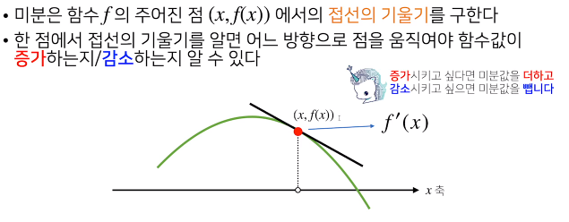
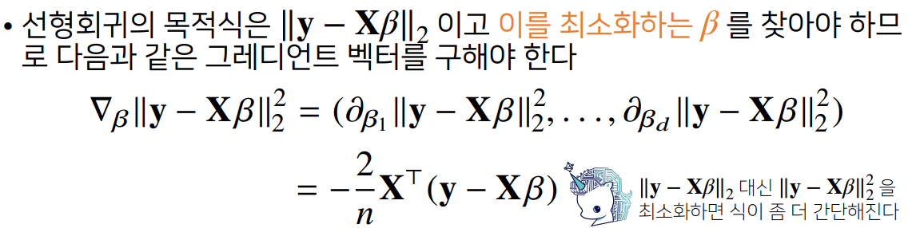
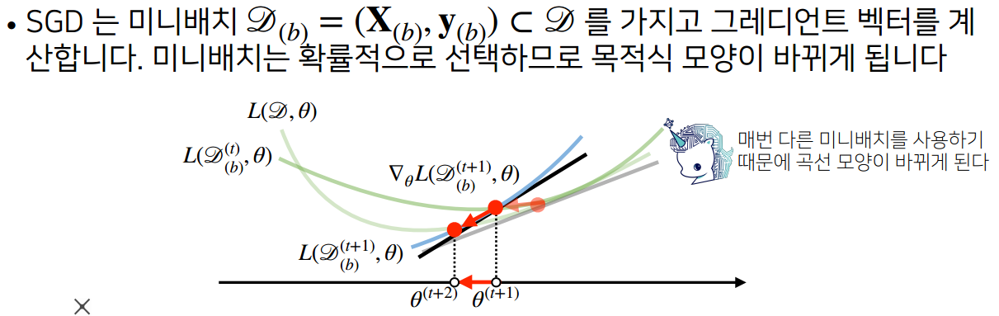

#### 미분 :변수의 움직임, 기울기

#### #미분함수
    sym.diff(sym.poly(x**2+2*x+3),x)     

#### 편미분
    sym.diff(sym.poly(9*y**2 + 3*y + 9*x + 3),x) 

### 경사상승법
미분값을 더해주면 함수값이 최대화

### 경사하강법
미분값을 빼주면 함수값이 최소화

- 두 방법은 극값에 도달하면 아무리 더하고빼줘도 움직이지 않는다 
-컴퓨터로 경사하강법을 계산할때는 미분이 정확히 0이 되는게 불가능하기때문에 
-eps값보다 작을때 종료하는 조건이 필요하다  

        while np.abs(diff) > epsilon:
            val -= lr_rate*diff
            diff, _ = func_gradient(fun,val)

### 경사하강법 기반 선형회귀 알고리즘

        for i in range(3000):
            error = y - X_ @ beta_gd
            grad = - np.transpose(X_) @ error
            beta_gd -= 0.01 * grad
            

-경사하강법은 미분 가능하고 볼록(convex)한 함수에 대해선 적절한 학습률과 학습횟수를 선택 했을때 수렴이 보장되지만, 
-비선형회귀문제의 경우 목적식이 볼록하지 않을 수 있으므로 수렴이 항상 보장되지는 않는다. 

###  확률적경사하강법 SGD(Stochastic Gradient Descent)
-모든 데이터를 사용해서 업데이트 하지 않고, 데이터 한개 또는 일부 활용하여 업데이트한다. 
-볼록이 아닌 (non-convex)목적식은 SGD를 통해 최적화 가능 

#### 원리 :미니배치연산

-매번 목적식의 모양이 바뀌기 때문에 경사하강법과 달리 local optimal을 탈출할 수 있다 
-그래서 머신러닝 학습에 더 효율적이다. 
-step 에 걸리는 시간이 짧기 때문에 수렴속도가 상대적으로 빠르다. 
-전체 학습데이터가 아닌 일부분의 학습데이터만 사용하기 때문에 메모리 사용이 BGD 보다 적다. 

